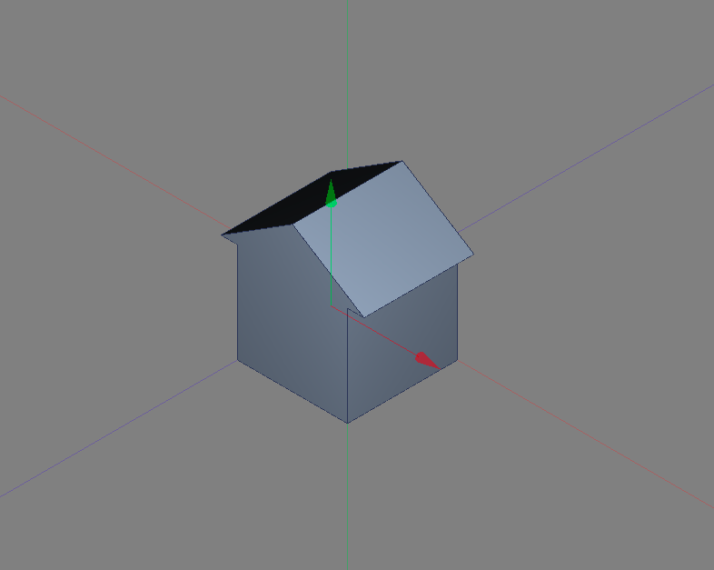

A browser-based CAD platform
============================

AnyFab is a free, browser based CAD platform.

The intention is to make it easy to design hardware (electrical or mechanical) and then to produce and scale it.

Features under construction:
- Browser based
- Free
- Built in ordering of off the shelf and custom parts
- Instant feedback on cost of manufacture
- Git integration
- Collaboration and design sharing
- Public library of ready-made designs
- Built using WebAssembly, so it runs in the browser but it’s as fast as if it were installed
- High quality REST APIs

